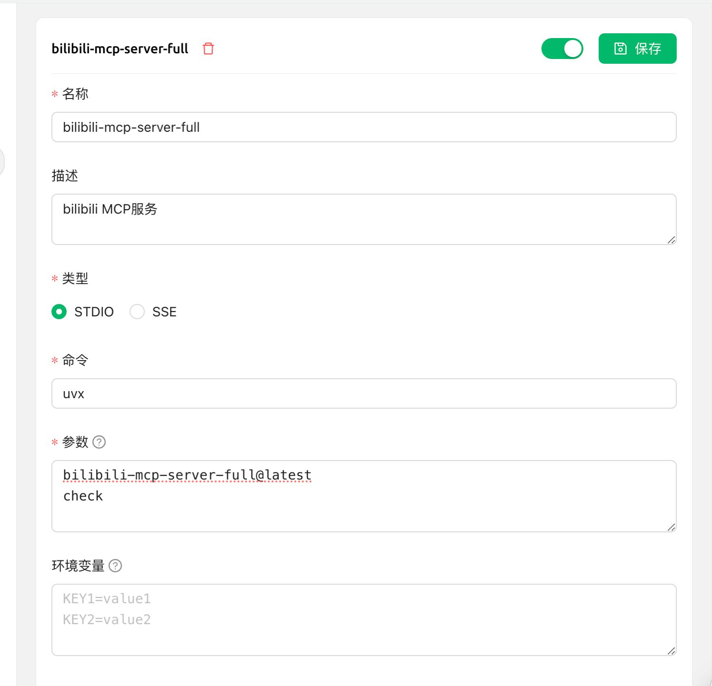

# bilibili_mcp_server_full

目前最便于安装的Bilibili MCP服务器, 支持最新的MCP协议，推荐使用Cherry Studio进行开发和使用，采用uv作为包管理工具。

## 开发

### 安装依赖

使用uv开发工具，安装依赖

```
uv sync
```

## Mcp Debug

```
uv run mcp dev src/bilibili_mcp_server_full/server.py
```

## Client Debug

```
uv run --with mcp mcp run src/bilibili_mcp_server_full/server.py
```

## 安装

```uvx
"bilibili-mcp-server-full": {
  "command": "uvx",
  "args": [
    "bilibili-mcp-server-full@latest",
    "check"
  ],
  "disabled": false
}
```


